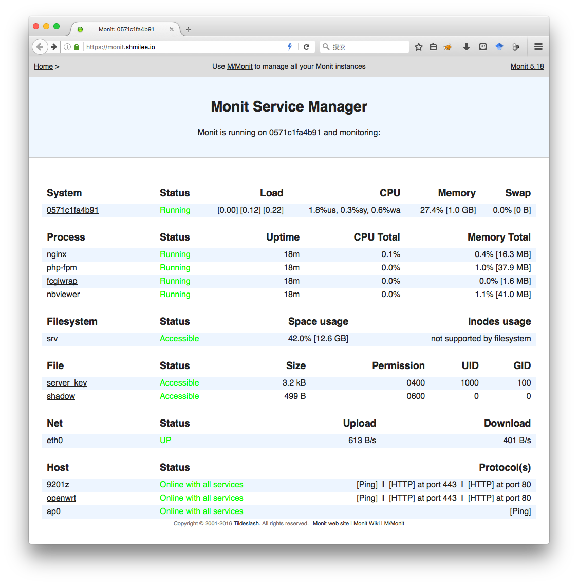

Status preview
==============

Monit's web interface:



```
$ docker exec -t mynginx_server ps aux
USER       PID %CPU %MEM    VSZ   RSS TTY      STAT START   TIME COMMAND
root         1  0.0  0.0   4188   640 ?        Ss   Jul02   0:01 /usr/bin/tini -
root         6  0.1  0.1 104960  6496 ?        Sl   Jul02   0:57 /usr/bin/monit 
root        15  0.0  0.0  47912  1332 ?        Ss   Jul02   0:00 nginx: master p
http        16  0.0  0.2  50500  9500 ?        S    Jul02   0:30 nginx: worker p
http        17  0.0  0.3  55960 14956 ?        S    Jul02   0:32 nginx: worker p
root        19  0.0  0.2 240860 11324 ?        Ss   Jul02   0:01 php-fpm: master
http        20  0.0  0.3 241052 15840 ?        S    Jul02   0:00 php-fpm: pool w
http        21  0.0  0.3 241052 15840 ?        S    Jul02   0:00 php-fpm: pool w
http        23  0.0  0.0  30108  2408 ?        Ss   Jul02   0:00 /bin/fcgiwrap
nbviewer    25  0.0  1.0 168136 42396 ?        S    Jul02   0:14 python -m nbvie
root       151  0.0  0.0  36360  3236 ?        Rs+  14:25   0:00 ps aux

$ docker exec -t mynginx_server pstree -p                                          :) 0
tini(1)─┬─fcgiwrap(23)
        ├─monit(6)───{monit}(135)
        ├─nginx(15)─┬─nginx(16)
        │           └─nginx(17)
        ├─php-fpm(19)─┬─php-fpm(20)
        │             └─php-fpm(21)
        └─python(25)

$ docker exec -t mynginx_server monit -c /srv/etc/monitrc summary                  :) 0
Monit uptime: 16h 0m
 Service Name                     Status                      Type          
 d64b2b871998                     Running                     System        
 nginx                            Running                     Process       
 php-fpm                          Running                     Process       
 fcgiwrap                         Running                     Process       
 nbviewer                         Running                     Process       
 server_key                       Accessible                  File          
 shadow                           Accessible                  File          
 srv                              Accessible                  Filesystem    
 9201z                            Online with all services    Remote Host   
 openwrt                          Online with all services    Remote Host   
 ap0                              Online with all services    Remote Host   
 eth0                             UP                          Network       

```

Docker image
============

./dockerfiles/readme.md

Build mynginx image, matplothub image.

owncloud
========

* `other_tools/oc-perms.sh <owncloud-path>`

* etc/sites-disabled/nginx-owncloud.vhost

* create database in MariaDB

ssl certificate
===============

```
sh ./gen-crt.sh
```

configurations
==============

* etc/
    - monitrc
    - nginx.conf
    - cgitrc     
    - cgitrepos
    - php.ini
    - php-fpm.conf
* log/
* root_files
* ...

systemd service
================

examples:

* service/matplothub.service
* service/mynginx.service
* service/kiwix-serve.service

Deploy
======

```
sh ./deploy.sh
```
